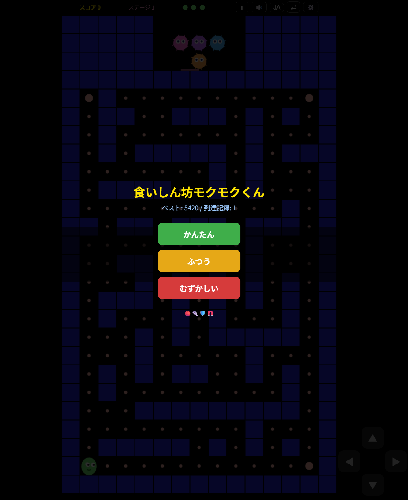
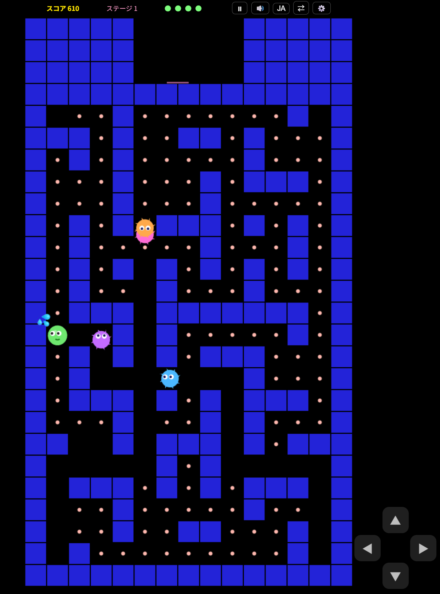

# Mokumoku Glotón

Un juego de acción para navegador en el que comes puntos y avanzas por laberintos generados al azar.
No necesita bibliotecas externas ni servidor.

## Cómo empezar

Abre `index.html` en un navegador web.
En smartphones se recomienda jugar en orientación vertical.

## Capturas de pantalla

### Pantalla de título

Muestra la mejor puntuación y el mejor nivel actuales, y permite elegir entre las dificultades FÁCIL, NORMAL y DIFÍCIL.

### Pantalla de juego

Muestra la puntuación, el nivel, las vidas restantes, el laberinto, los puntos, los fantasmas, los objetos y los controles en pantalla.
Los botones de la esquina superior derecha permiten controlar la pausa, el sonido, el idioma, la posición de la cruceta y los ajustes.

## Cómo jugar

Elige FÁCIL, NORMAL o DIFÍCIL en la pantalla de título.
Come todos los puntos del laberinto para superar el nivel.
Tocar un fantasma cuesta una vida. Al comer un punto de poder, puedes derrotar fantasmas durante un tiempo limitado.
A partir del nivel 2 pueden aparecer objetos que aumentan la velocidad, ofrecen un escudo o alejan a los fantasmas.
Cuando se cumplen ciertas condiciones aparece una fruta. Cómela para conseguir puntos extra.

## Controles

- Teclado: teclas de dirección o W/A/S/D
- Smartphone: cruceta en pantalla o deslizar el dedo por la pantalla
- Pausa: tecla `P`, tecla `Esc` o botón de pausa en la parte superior
- Botones superiores: activar/desactivar el sonido, cambiar el idioma, mover la cruceta y abrir los ajustes

## Ajustes y datos guardados

Puedes ajustar el volumen de la música, los efectos de sonido y la vibración.
Las mejores puntuaciones y los ajustes se guardan en el `localStorage` del navegador.
Al borrar los datos del sitio en el navegador también se reinician estos registros.

## Idiomas disponibles

El juego admite japonés, inglés, chino, coreano y español.
Pulsa el botón de idioma para alternar entre ellos.
